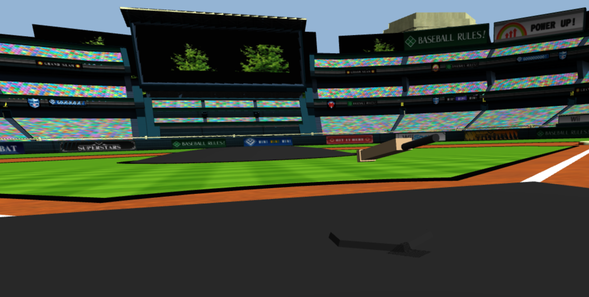

# 🏏 3DCricket_ThreeJS


An online **Three.js-powered Cricket simulator** inspired by *Wii Sports Baseball*!  
Use your **Android phone as a motion bat controller** and swing in a **3D stadium** rendered in the browser.  
Play cricket with friends in real time — all in your browser.

⚠️ **Disclaimer:** This is a **demonstration prototype**. ITS NOT COMPLETE!!!. Stadium assets and parts of the implementation are placeholders — the real value lies in the **1:1 phone-to-bat motion system** powered by gyroscope sensors.

---

## ✨ Features
- 📱 **Mobile phone as bat controller** (Android only).  
- 🎮 **Real-time bat swings** mapped into a 3D environment.  
- 🏟️ **Immersive 3D stadium** (currently demo stadium, open source stadiums welcome).  
- ⚡ **WebSocket sync** via `socket.io` for low-latency multiplayer.  
- 🌐 **Runs in browser** with Node.js backend (`express`, `socket.io`, `mkcers`, `three`).  
- 🔥 Designed to be extended into a **full open-source cricket game**.

---

## 🚀 Getting Started

### 1. Clone the repo
```bash
git clone https://github.com/your-username/3DCricket_ThreeJS.git
cd 3DCricket_ThreeJS
````

### 2. Install dependencies

```bash
npm install
```

### 3. Run the server

```bash
node server.js
```

Server will start on port `3443` (HTTPS).

### 4. Connect

* On your **desktop/laptop** → open `https://<YOUR-IP>:3443/` (game screen).
* On your **Android phone** → open `https://<YOUR-IP>:3443/connect.html` (bat controller).

⚠️ Replace `<YOUR-IP>` with your **local machine’s IP address**.


## ⚙️ Tech Stack

* [Three.js](https://threejs.org/) → 3D rendering
* [Node.js](https://nodejs.org/) → backend runtime
* [Express](https://expressjs.com/) → web server
* [Socket.IO](https://socket.io/) → real-time communication
* [mkcerts] → allow motion sensor streaming

---

## 🛠️ Development Notes

* Works on **Android 9, 10, 11**.
* Currently **does not work on iOS** due to Safari sensor restrictions.
* Default stadium is a demo `.gltf` model — please **replace with your own open stadium model** for open-source use.
* Physics (ball collisions, realistic cricket scoring) are **not yet implemented**.
* Motion mapping is **1:1**, the main innovation behind this project.

---

## 📌 Roadmap

* ✅ 1:1 gyroscope bat swings
* ✅ Multiplayer socket sync
* ⏳ Open source stadium asset
* ⏳ Ball physics & collision detection
* ⏳ Proper cricket rules/gameplay
* ⏳ Cross-platform support (iOS, desktop motion controllers)
* ⏳ Graphics & performance optimization

---

## 🤝 Contributing

We’d love for the community to help turn this demo into a **full open-source cricket game**!

Ways to contribute:

* 🎨 Create a new open-source stadium model.
* ⚡ Optimize physics, ball throwing, and collisions.
* 📱 Add iOS compatibility.
* 🕹️ Expand gameplay modes (multiplayer matches, scoring, AI bowlers).
* 🐞 Fix bugs and improve stability.

PRs are welcome! Please open an issue to discuss major changes before submitting.

---

## 📜 License

MIT License — free to use, modify, and distribute.
(Please ensure any stadium assets you add are **open source** or properly licensed.)

---

## 🌍 Acknowledgements

* Inspired by Nintendo Wii Sports Baseball.
* Built with open-source libraries: Three.js, Socket.IO, Express.
* chatGPT and DeepSeek

---

💡 *This is just the beginning. The 1:1 phone-to-bat motion system is the **real game changer** — let’s build the full cricket experience together!*

